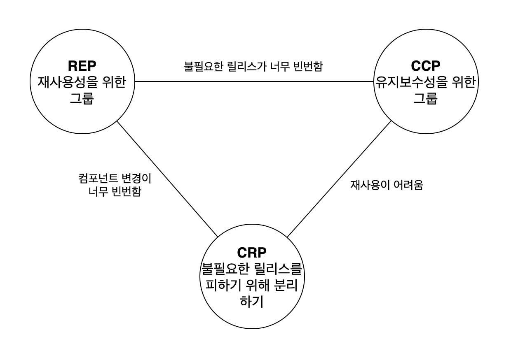

# 클린 아키텍처 (컴포넌트 응집도)

## 컴포넌트란?

 컴포넌트는 배포 단위입니다. **컴포넌트는 시스템의 구성 요소로 배포할 수 있는 가장 작은 단위**입니다. 자바의 경우 jar 파일이 컴포넌트입니다. 루비에서는 gem, 닷넷에서는 DLL입니다. 컴파일형 언어에서 컴포넌트는 바이너리 파일의 결합체입니다. 인터프리터형 언어의 경우는 소스 파일의 결합체입니다. 모든 언어에서 컴포넌트는 배포할 수 있는 단위 입자입니다.

## 컴포넌트 응집도

 그렇다면 어떤 클래스를 어느 컴포넌트에 포함시켜야할까요? 이는 중요한 결정이므로, 제대로 된 소프트웨어 엔지니어링 원칙의 도움을 받아야 합니다. 그 원칙으로는 아래의 세 가지 원칙이 있습니다.

-   REP : 재사용/릴리스 등가 원칙 (Reuse/Release Equivalence Principle)
    
-   CCP : 공통 폐쇄 원칙 (Common Closure Principle)
    
-   CRP : 공통 재사용 원칙 (Common Reuse Principle)
    

 다음으로 위 세 가지 원칙에 대해서 알아보겠습니다.

### REP : 재사용/릴리스 등가 원칙 (Reuse/Release Equivalence Principle)

**재사용 단위는 릴리스 단위와 같다.**

 우리는 소프트웨어 재사용의 시대에 살고 있습니다. 그렇기 때문에 소프트웨어 컴포넌트가 릴리스 절차를 통해 추적 관리되지 않거나 릴리스 번호가 부여되지 않는다면 해당 컴포넌트를 재사용하고 싶어도 할 수도 없고, 하지도 않을 것입니다. 릴리스 번호가 없다면 재사용 컴포넌트들이 서로 호환되는지 보증할 방법이 전혀 없기 때문입니다. 하지만 이 단순한 이유 말고도 다른 이유가 있는데, 새로운 버전이 언제 출시되고 무엇이 변했는지를 소프트웨어 개발자들이 알아야 하기 때문입니다.

 새로운 릴리스가 나온다는 소식을 접하면, 개발자는 새 릴리스의 변경 사항을 살펴보고 기존 버전을 계속 쓸지 여부를 결정하곤 합니다. 따라서 릴리스 절차에는 적절한 공지와 함께 릴리스 문서 작성도 포함되어야 합니다. 그래야 개발자들이 충분한 정보를 바탕으로 새 릴리스를 통합할지, 한다면 언제 할지 결정할 수 있게됩니다.

**이 원칙을 소프트웨어 설계와 아키텍처 관점에서 보면 단일 컴포넌트는 응집성 높은 클래스와 모듈로 구성되어야 함을 뜻합니다.**

 하나의 컴포넌트로 묶인 클래스와 모듈은 반드시 함께 릴리스 할 수 있어야 합니다. 하나의 컴포넌트로 묶인 클래스와 모듈은 버전 번호가 같아야 하며, 동일한 릴리스로 추적 관리되고, 동일한 릴리스 문서에 포함되어야 합니다.

### CCP : 공통 폐쇄 원칙 (Common Closure Principle)

**동일한 이유로 동일한 시점에 변경되는 클래스를 같은 컴포넌트로 묶어야 하고, 서로 다른 시점에 다른 이유로 변경되는 클래스는 다른 컴포넌트로 분리해야 한다는 원칙입니다.** 이 원칙은 **단일 책임 원칙(SRP)을 컴포넌트의 관점에서 다시 정의한 것**입니다. SRP에서 단일 클래스는 변경의 이유가 여러 개 있어서는 안 된다고 말하듯이, CCP에서도 마찬가지로 단일 컴포넌트는 변경의 이유가 여러 개 있어서는 안 된다고 이야기 합니다.

 대다수의 애플리케이션에서 유지보수성(maintainability)은 재사용성보다 훨씬 중요합니다. 애플리케이션의 코드가 반드시 변경되어야 한다면, 이러한 변경이 여러 컴포넌트 도처에 분산되어 발생하기보다는, 차라리 변경 모두가 단일 컴포넌트에서 발생하는 편이 낫습니다. 만약 변경을 단일 컴포넌트로 제한할 수 있다면, 해당 컴포넌트만 재배포하면 됩니다. 변경된 컴포넌트에 의존하지 않는 다른 컴포넌트는 다시 검증하거나 배포할 필요가 없습니다.

 이 원칙은 개방 폐쇄 원칙(OCP)과도 밀접하게 관련되어 있습니다. 실제로 CCP에서 말하는 '폐쇄(Closure)'는 OCP에서 말하는 '폐쇄(Closure)'와 그 뜻이 같습니다. OCP에서는 클래스가 변경에는 닫혀 있고, 확장에는 열려 있어야 한다고 말합니다. 100% 완전한 폐쇄는 불가능하므로 전략적으로 폐쇄해야 합니다.

 CCP에서는 동일한 유형의 변경에 대해 닫혀 있는 클래스들을 하나의 컴포넌트로 묶음으로써 OCP에서 얻은 교훈을 확대 적용합니다. 따라서 변경이 필요한 요구사항이 발생했을 때, 그 변경이 영향을 주는 컴포넌트들이 최소한으로 한정될 가능성이 확실히 높아지게 됩니다.

### CRP : 공통 재사용 원칙 (Common Reuse Principle)

**컴포넌트 사용자들을 필요하지 않는 것에 의존하게 강요하지 말라.**

 공통 재사용 원칙도 클래스와 모듈을 어느 컴포넌트에 위치시킬지 결정할 때 도움이 되는 원칙입니다. CRP에서는 같이 재사용되는 경향이 있는 클래스와 모듈들은 같은 컴포넌트에 포함해야 한다고 말합니다.

 이처럼 CRP는 각 컴포넌트에 어떤 클래스들을 포함시켜야 하는지를 설명해줍니다. 하지만 이뿐만 아니라, 동일한 컴포넌트로 묶어서는 안되는 클래스가 무엇인지도 말해줍니다. 어떤 컴포넌트가 다른 컴포넌트를 사용하면, 두 컴포넌트 사이에는 의존성이 생깁니다.  사용하는(using) 컴포넌트가 사용되는(used) 컴포넌트에서 단 하나의 클래스만 사용할 수도 있습니다. 그렇다고 해서 의존성은 조금도 약해지지 않고 여전히 사용하는 컴포넌트가 사용되는 컴포넌트에 의존하고 있습니다.

 이 같은 의존성으로 인해 사용되는 컴포넌트가 변경될 때마다 사용하는 컴포넌트도 변경해야 할 가능성이 높습니다. 또는 사용하는 컴포넌트를 변경하지 않더라도, 재컴파일, 재검증, 재배포를 해야 하는 가능성은 여전히 남아 있습니다. 심지어 사용되는 컴포넌트에서 발생한 변경이 사용하는 컴포넌트와는 전혀 관련이 없는 경우도 마찬가지입니다.

**따라서 의존하는 컴포넌트가 있다면 해당 컴포넌트의 모든 클래스에 대해 의존함을 확실하게 인지해야 합니다.**

 CRP는 어떤 클래스를 한데 묶어도 되는지보다는, 어떤 클래스를 한데 묶어서는 안 되는지에 대해서 훨씬 더 많은 것을 이야기하고 있습니다. 즉, **CRP는 강하게 결합되지 않은 클래스들을 동일한 컴포넌트에 위치시켜서는 안 된다는 것을 강조하고 있는 것입니다.**

 위의 맥락은 인터페이스 분리 원칙(ISP)과 문맥이 같아보입니다. CRP는 사실 ISP의 포괄적인 버전입니다. ISP는 사용하지 않는 메서드가 있는 클래스에 의존하지 말라고 이야기하고 있고, CRP는 사용하지 않는 클래스를 가진 컴포넌트에 의존하지 말라고 이야기하고 있습니다.

### 컴포넌트 응집도에 대한 균형 다이어그램

REP와 CCP는 포함(inclusive) 원칙으로,두 원칙은관련있는 클래스들을 한 컴포넌트로 묶음으로써 컴포넌트를 더욱 크게 만듭니다. 반대로 CRP는 배제(exclusive) 원칙으로, 불필요한 클래스에 의존하지 않도록 분리하여 컴포넌트의 크기를 더욱 작게 만듭니다.

 위 그림은 세 원칙이 어떻게 상호작용하는지 보여줍니다. 다이어그램의 각 변은 반대쪽 꼭지점에 있는 원칙을 포기했을 때 감수해야할 비용을 나타냅니다.

 REP와 CRP에만 중점을 두면, 사소한 변경이 생겼을 때 너무 많은 컴포넌트에 영향을 미칩니다. 반대로 CCP와 REP에만 과도하게 집중하면 불필요한 릴리스가 너무 빈번해집니다.

 우리는 이 세 원칙들 사이에서 현재 관심을 기울이는 부분을 충족시키는 균형점를 찾아야 하며, 또한 시간이 흐르면서 이 균형점은 유동적으로 변한다는 사실을 이해하고 있어야 합니다. 원칙들의 균형점은 현재 상황에 맞게 잘 분배했더라도, 내년이 되면 맞지 않을 수 있습니다. 즉, 프로젝트의 컴포넌트 구조는 시간과 성숙도에 따라서 변한다는 이야기입니다.

---

## 참고자료

[Clean Architecture](http://www.kyobobook.co.kr/product/detailViewKor.laf?ejkGb=KOR&mallGb=KOR&barcode=9788966262472&orderClick=LAG&Kc=) <<로버트C. 마틴 지음>>