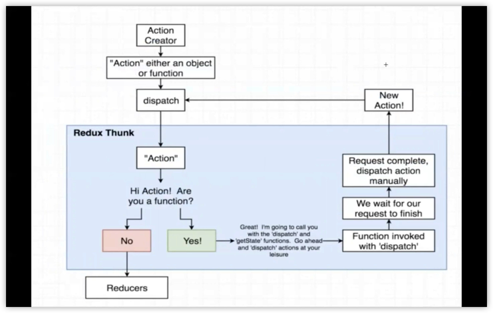
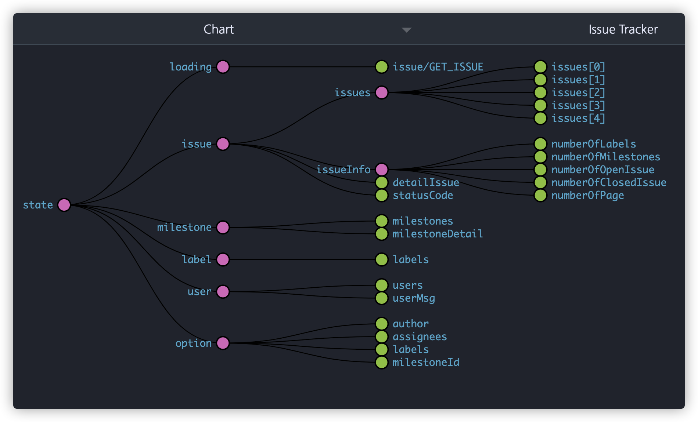

# [React] 환경설정 제대로 알고 하기 (without CRA) ①

> CRA(create-react-app)은 강력하고 편리하지만, 환경설정을 커스텀해서 사용하다가 전체가 어그러지는 상황이 올 수 있어 어렵습니다.  
> 이번 포스팅에서는 초심자로서 CRA를 사용하지 않고 환경 설정하는 방법을 개괄적으로 설명하려고 합니다.  
> 참고: 함수형 컴포넌트 기반으로 구성되었습니다.

## 참고한 환경설정

처음 환경설정을 시작할 때는 아래에 잘 정리된 설정을 따라 해 보면서 완성했습니다.

한번 잘 동작하는 것을 만들어 두면 다른 프로젝트에서는 조건에 맞게 가감할 수 있다고 생각합니다.

참고한 환경설정을 바탕으로 이해하고 쓰는 저만의 boilerplate를 구축하고 있는 것을 소개할 예정입니다.

- [React + Typescript + SSR + Code-splitting 환경 설정하기](https://medium.com/@minoo/react-typescript-ssr-code-splitting-%ED%99%98%EA%B2%BD%EC%84%A4%EC%A0%95%ED%95%98%EA%B8%B0-d8cec9567871)
- [요즘 잘나가는 프론트엔드 개발 환경 만들기(2018): Webpack 4](https://meetup.toast.com/posts/153)

## 목차

1. 프로젝트 생성
2. 기본 라이브러리 설치
3. babel 환경설정
4. 회고

## 1. 프로젝트 생성

### npm 프로젝트 초기화

- `npm`은 **노드 패키지 매니저**로, 노드에서 사용하는 각종 코드 패키지들을 사용할 수 있게 해 주는 역할을 합니다.
- `npm init`을 하고 옵션을 작성하면 다음과 같이 초기화된 정보가 **package.json**에 생성됩니다.
- `-y` 속성을 추가하면 옵션을 자동으로 기본값으로 설정해 npm을 초기화시킬 수 있습니다.

```json
npm init -y

// output: package.json
{
  "name": "choisohyun",
  "version": "1.0.0",
  "description": "",
  "main": "index.js",
  "scripts": {
    "test": "echo \"Error: no test specified\" && exit 1"
  },
  "keywords": [],
  "author": "",
  "license": "ISC"
}
```

### dependencies

- npm 프로젝트를 초기화하고 라이브러리를 `npm intall` 명령어로 설치하면 기본적으로 dependencies에 버전과 함께 저장됩니다.
- 버전은 `"^0.19.2"(캐럿)` 와 같은 형태로 저장됩니다. 예시는 `1.0.0 미만`까지만 업데이트를 허용한다는 의미입니다.
  - 참고: `"~0.19.2(틸드)"`의 형태로 되어 있다면 `0.20.0 미만` 버전까지만 허용한다는 의미입니다.
- 가장 앞의 숫자는 메이저 버전을 뜻하는데, 메이저 버전이 바뀌면 로직이 크게 바뀌어 에러가 발생하는 경우가 있어서 기본적으로 메이저 버전을 올리지 않게끔 작동합니다.

### devDependencies

- 개발할 때에만 쓰이는 라이브러리는 `npm install -D` 또는 `npm install --save-dev` 명령어를 통해 devDependencies에 저장합니다.
- 여기서 개발할 때만 쓰이는 것이라는 의미는 **빌드(컴파일)될 때**까지만 쓰인다는 것입니다. 즉, 트랜스파일러, 컴파일러에 속하는 라이브러리들입니다.
- 예. babel, typescript, webpack, loader

### scripts

- scripts에 `key: value` 형식으로 스크립트를 저장해 `npm run {key}` 로 실행할 수 있는 옵션입니다.
- 이 포스팅에서는 devServer를 실행하는 `start`와 빌드하는 `build` 스크립트를 사용합니다. 자세한 설정은 밑에서 설명합니다.
- 추가적인 scripts 사용법은 [공식 홈페이지](https://docs.npmjs.com/using-npm/scripts.html)에서 확인할 수 있습니다.

### package-lock.json

- package-lock.json 파일은 npm으로 라이브러리를 설치하면 자동으로 생성됩니다.
- 의존성 트리에 대한 정보를 가지고 있어 파일이 작성된 시점의 의존성 트리가 다시 생성될 수 있도록 보장합니다.
- `package-lock.json` 파일은 저장소에 꼭 같이 커밋해야 합니다.

## 2. 기본 구성 라이브러리 설치

### ① React 관련 라이브러리 설치

- 기본 React 라이브러리들을 설치합니다.

```bash
npm install react react-dom react-router-dom
```

### [react](https://www.npmjs.com/package/react)

- UI를 만들기 위한 라이브러리입니다.
- React 구성 요소를 정의하는 데 필요한 기능만 있기 때문에 일반적으로 `react-dom`이나 `react-native`와 함께 사용합니다. 이 포스팅에서는 `react-dom`을 함께 사용합니다.

React에 대한 자세한 사용 방법과 내용은 [공식 홈페이지](https://ko.reactjs.org/docs/getting-started.html)에서 보실 수 있습니다.

### [react-dom](https://www.npmjs.com/package/react-dom)

- React의 DOM 및 서버 렌더러에 대한 진입점 역할을 합니다.
- React 패키지와 쌍을 이루도록 설계되었습니다.

### [react-router-dom](https://www.npmjs.com/package/react-router-dom)

- 웹에서 SPA(Single Page Application)을 만들 때 사용합니다.
- `path`와 `component`를 설정해 해당 주소에 맞는 페이지를 렌더할 수 있고, useHistory와 같은 history hook을 사용할 수도 있습니다.

### ② 스타일 관련 라이브러리 설치

- CSS in JS 라이브러리 중 하나인 styled component와 styled reset 라이브러리를 설치합니다.

```bash
npm install styled-component styled-reset
```

### [styled component](https://styled-components.com/docs/basics#motivation)

- React의 컴포넌트 형식으로 jsx 안에 스타일을 작성할 수 있게 해 주는 라이브러리입니다.

다양한 CSS in JS 라이브러리가 있어 장단점이 있지만, [npm trend](https://www.npmtrends.com/aphrodite-vs-emotion-vs-glamorous-vs-jss-vs-radium-vs-styled-components-vs-styletron)의 수치와 참고자료 양으로 선택했습니다. 선호도에 따라 다른 스타일 라이브러리나 일반 css를 사용할 수 있습니다.

### [styled reset](https://www.npmjs.com/package/styled-reset)

- Vanilla JS에서 스타일을 작성할 때 스타일을 reset해주는 것과 동일한 기능의 라이브러리입니다.

styled component와 같이 선호도에 따라 사용 유무를 결정할 수 있습니다.

### ③ Redux 상태관리 관련 라이브러리 설치

- 상태관리를 위해 redux 관련 라이브러리를 설치합니다.
- 이 포스팅에서는 redux thunk를 사용합니다.

```jsx
npm install react-redux redux redux-thunk redux-devtools-extension
```

### [redux, react-redux](https://www.npmjs.com/package/redux)

- Redux는 Javascript 앱을 예측 가능한 상태로 만들어 주는 라이브러리입니다.
- React Redux는 React 앱에서 스토어를 만들어 주면 스토어 안 데이터가 변경되었는지 확인한 다음 해당 컴포넌트를 다시 렌더링합니다.

React 프로젝트를 할 때 View를 독자적으로 하는 상태관리를 진행할 수 있어서 사용합니다.

### [redux-thunk](https://www.npmjs.com/package/redux-thunk)

- Redux Thunk는 React의 상태관리에서 쓸 수 있는 미들웨어 중 하나입니다.
- **미들웨어**는 `dispatch와 action 사이`에서 일어나는 작업들을 처리해 주는 중간자입니다.
- **Thunk**는 parameters를 받아 실행하고 또 다른 함수를 return하는 함수입니다.

위의 Redux + useReducer만으로도 상태관리를 할 수 있지만, 미들웨어를 사용하면 View에서 일어나는 상태 변화에 대해서 독립적으로 관리할 수 있어서 편리합니다.

아래는 Redux Thunk의 흐름을 나타낸 그림입니다.



### redux-devtools-extension

- Redux를 사용할 때 액션과 현재 상태를 가시적으로 볼 수 있게 해 주는 라이브러리입니다.
- 사용할 때에는 `composeWithDevTools`를 store에서 미들웨어와 함께 만들면 됩니다.

```jsx
import ReduxThunk from "redux-thunk";
import { applyMiddleware, createStore } from "redux";
import { composeWithDevTools } from "redux-devtools-extension";

const middleware = applyMiddleware(ReduxThunk);
const store = createStore(yourReducer, composeWithDevTools(middleware));
```

- 성공적으로 들어간다면 아래와 같은 트리 형태 및 객체 형태의 store 상황을 보면서 개발할 수 있습니다.



## 3. babel 환경설정

### [babel](https://babeljs.io/docs/en/next/)

- 자바스크립트 트랜스파일러입니다.
- ES6 문법을 사용하면서 이전 버전의 브라우저(IE)까지 호환되는 코드로 변환해 줍니다.
- 사용하는 툴에 따라 다른 preset과 plugin을 설치하고 설정하면 트랜스파일링을 할 수 있게 됩니다.
- 보통 `webpack`과 같은 빌드 툴과 함께 사용합니다.

### ① babel 관련 라이브러리 설치

- babel은 트랜스파일러이기 때문에 빌드할 때까지만 쓰이고 이후 실행할 때는 쓰이지 않습니다. 따라서 `devDependencies`에 저장되도록 `-D` 옵션을 지정합니다.

```json
npm install -D @babel/core @babel/preset-env @babel/preset-react babel-preset-react @babel/proposal-class-properties @babel/syntax-dynamic-import
```

### [core](https://www.npmjs.com/package/@babel/core)

- babel을 사용하기 위해 필수로 설치해야 하는 패키지입니다.

> `preset`은 여러 개의 `plugin` 설정을 한 번에 적용할 때 사용합니다.

### [preset-env](https://babeljs.io/docs/en/babel-preset-env#install)

- 범용적인 preset으로, ES6 이상의 문법으로 작성된 코드를 ES5 문법의 코드로 변환해 주는 모든 규칙을 정의한 **preset**입니다.
- 아래와 같이 지원하고자 하는 브라우저 버전 리스트를 설정할 수 있습니다.

```json
{
  "targets": "> 0.25%, not dead"
}
```

### [preset-react](https://babeljs.io/docs/en/babel-preset-react)

- JSX로 작성된 코드를 createElement 함수를 이용한 코드로 변환하는 preset입니다.
- `@babel/plugin-syntax-jsx`, `@babel/plugin-transform-react-jsx`, `@babel/plugin-transform-react-display-name`다음과 같은 플러그인을 포함하고 있습니다.

> `plugin`은 npm 라이브러리를 가지고 있는 하나의 규칙을 적용할 때 사용합니다.

### [plugin-proposal-class-properties](https://babeljs.io/docs/en/babel-plugin-proposal-class-properties)

- class에서 property를 사용할 수 있게 하는 플러그인입니다.
- 이 플러그인이 없으면 class 사용 시 오류가 나게 됩니다.

### [plugin-syntax-dynamic-import](https://babeljs.io/docs/en/babel-plugin-syntax-dynamic-import)

- Dynamic import로 `Code Splitting`을 구현할 때 사용하는 플러그인입니다.
- Webpack이 `import('./example').then();` 구문을 만나게 되면 코드를 분할하게 되는 것입니다.
- `Suspense, lazy`나 `loadable component`를 사용하여 `Code Splitting`을 구현한다면 사용하지 않아도 됩니다.

### ② babel.config.js 설정

- 위에서 설치한 babel preset, plugin를 프로젝트에 적용하기 위해 다음과 같이 작성해 `babel.config.js` 파일로 저장합니다.
- preset은 **presets** 배열로, plugin은 **plugins** 배열 객체로 저장하면 됩니다.

```js
module.exports = {
  presets: ["@babel/preset-env", "@babel/preset-react"],
  plugins: ["@babel/proposal-class-properties", "@babel/syntax-dynamic-import"],
};
```

## 4. 결론

> 이번 포스팅에서는 Webpack으로 React 프로젝트를 시작하기 위한 발판을 기본 라이브러리들과 babel 설정을 통해 다졌습니다.
> 다음 포스팅에서는 webpack 설정을 개발/배포로 나눠서 하는 방법에 대해 작성할 예정입니다.

### 회고

CRA로는 모르고 넘어가기 쉽고, 설정을 했더라도 되는 대로 하고 넘어가기 쉽습니다.  
포스팅을 위해 정리하면서 몰랐던 개념들을 알 수 있었습니다.
